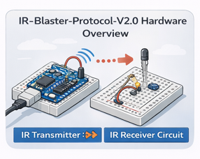
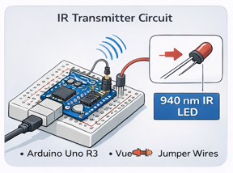
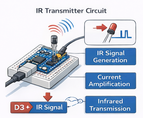
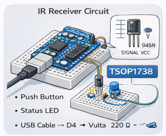
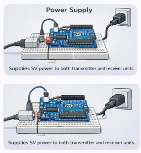
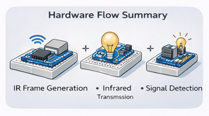
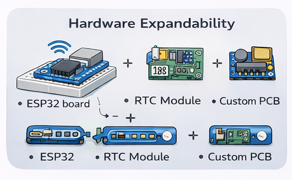

# Hardware Setup
# Hardware Setup – IR-Blaster-Protocol-V2.0

This document outlines the complete hardware architecture of the **IR-Blaster-Protocol-V2.0** project. It details two interconnected circuits: an **IR Transmitter** and an **IR Receiver with Pairing Support**. Together, these units enable robust, gateway-less, and metadata-driven infrared communication, perfect for embedded and IoT applications.

---

## System Overview

The project is conceptually divided into two primary hardware blocks, designed for modularity and ease of development:

1.  **IR Transmitter Unit**: Focuses on signal generation and efficient IR emission.
2.  **IR Receiver Unit with Pairing Button**: Handles signal detection, data extraction, and secure pairing.

Both units leverage readily available, low-cost components, making them ideal for rapid prototyping and educational exploration in embedded systems.

---

## 1. IR Transmitter Hardware Setup

This section details the components and connections required for the IR Transmitter, the heartbeat of our communication system.

### Purpose
The IR transmitter circuit is meticulously designed to generate modulated infrared signals that carry essential structured metadata, such as a unique sender ID and specific command instructions.

### Components Required

| Component | Quantity | Description |
|:--------------------------|:---------|:----------------------------------------------|
| **Arduino Uno R3** | 1        | The microcontroller orchestrating signal generation. |
| **IR LED (940 nm)** | 1        | The core component for emitting infrared light. |
| **NPN Transistor (BC547 / 2N2222)** | 1 | Acts as a current amplifier to drive the IR LED efficiently. |
| **Resistor (220 Ω)** | 1        | Crucial for limiting the base current to the transistor. |
| **Breadboard** | 1        | For convenient, solder-less circuit assembly. |
| **Jumper Wires** | As needed | For making all necessary electrical connections. |

### Pin Connections

The following table outlines the precise connections for the IR Transmitter circuit to the Arduino Uno R3:

| Arduino Pin | Connected To                                |
|:------------|:--------------------------------------------|
| **D3** | Transistor Base (via 220 Ω resistor)        |
| **5V** | IR LED Anode                                |
| **GND** | Transistor Emitter (and IR LED Cathode)     |

### Working Principle

The IR transmission process is a carefully synchronized sequence of events:

1.  **Signal Generation**: Arduino pin D3 initiates the process by generating precise, timed IR pulses according to the defined protocol.
2.  **Current Amplification**: The NPN transistor significantly amplifies the low current from the Arduino pin, ensuring enough power to drive the IR LED effectively.
3.  **Infrared Emission**: The IR LED then converts these electrical pulses into infrared light, carrying the encoded protocol frame.
4.  **Metadata Transmission**: Critical metadata, including the sender ID and command, is embedded and transmitted by carefully varying the pulse timings and patterns.

---

## 2. IR Receiver Hardware Setup (With Pairing)

This section focuses on the IR Receiver unit, including its components, connections, and the vital role of the pairing button in establishing secure communication.

### Purpose
The IR receiver circuit is engineered to accurately detect incoming IR signals, intelligently extract embedded metadata, verify pairing status against stored IDs, and finally, execute authorized commands.

### Components Required

| Component | Quantity | Description |
|:------------------------------------|:---------|:---------------------------------------------|
| **Arduino Uno R3** | 1        | The microcontroller for metadata processing and logic. |
| **IR Receiver Module (TSOP1738 / VS1838B)** | 1 | Specialized module for detecting 38kHz IR signals. |
| **LED** | 1        | A visible LED for status indication (e.g., power, pairing, command received). |
| **Resistor (220 Ω)** | 1        | Limits current to the status LED, preventing burnout. |
| **Push Button** | 1        | Activates the crucial pairing mode. |
| **Breadboard** | 1        | For circuit assembly. |
| **Jumper Wires** | As needed | For all necessary electrical connections. |

### Pin Connections

The following table provides the precise connections for the IR Receiver circuit to the Arduino Uno R3:

| Component        | Arduino Pin |
|:-----------------|:------------|
| **TSOP OUT** | D2          |
| **TSOP VCC** | 5V          |
| **TSOP GND** | GND         |
| **Pair Button** | D4 → GND    |
| **Status LED** | D13 (via 220 Ω resistor) |

> **Note:** The pairing button is designed to utilize `INPUT_PULLUP` in the Arduino code. This means it connects to GND when pressed, and no external pull-up resistor is required, simplifying the circuit.

### Pairing Button Role

The pairing button is a fundamental security feature, enabling controlled and secure communication:

* **Enables Pairing Mode**: When pressed, it actively switches the receiver into a dedicated pairing mode.
* **Learns Sender Identity**: In this mode, the receiver listens for an incoming IR signal and intelligently captures the unique ID of the sender.
* **Stores Sender ID**: The newly learned sender ID is then securely stored in the Arduino's EEPROM, ensuring persistence even after power cycles.
* **Prevents Unauthorized Access**: Once successfully paired, the receiver will exclusively process and act upon commands originating from the *authorized* sender, significantly enhancing system security.

---

## 3. Power Supply

Both the IR Transmitter and IR Receiver units are designed for straightforward and efficient power management:

* **USB Powered**: They are conveniently powered via a standard USB connection, offering flexibility from a computer, a USB wall adapter, or a portable power bank.
* **Operating Voltage**: The stable operating voltage for both circuits is **5V DC**.
* **Low-Power Operation**: This characteristic makes them highly suitable for energy-efficient embedded operations and effortless integration into diverse projects.

---

## 4. Hardware Flow Summary

The entire communication process, from the initial transmission to the final command execution, follows a well-defined and logical sequence:

1.  **Transmit IR Frame**: The transmitter unit generates a robust, metadata-based IR frame, encapsulating the sender ID and the specific command.
2.  **Send Encoded Signal**: The IR LED converts these electrical pulses into a carefully encoded infrared signal, ready for transmission.
3.  **Detect IR Signal**: The receiver's IR module vigilantly detects the incoming infrared signal from the environment.
4.  **Parse and Validate Metadata**: The receiver then meticulously extracts and validates the embedded metadata (sender ID, command) from the detected signal.
5.  **Execute Commands**: Only if the sender is authorized (i.e., successfully paired), the corresponding command is securely executed by the receiver.

---

## 5. Safety and Best Practices

Adhering to safety guidelines and best practices ensures the longevity of your components and the reliability of your project:

* **Current-Limiting Resistors**: Always use appropriate current-limiting resistors for all LEDs (both IR and visible) to prevent component damage and protect the microcontroller pins.
* **Eye Safety**: Avoid direct and prolonged eye exposure to the IR LED. While infrared light is invisible, it can still pose a risk to eye health.
* **Environmental Considerations**: Position the IR receiver module away from strong direct sunlight, fluorescent lights, or other intense IR sources, as these can cause significant interference and lead to false readings.
* **Proper Grounding**: Ensure all circuits are correctly grounded. Proper grounding is essential for preventing electrical issues, ensuring signal integrity, and maintaining stable operation.

---

## 6. Expandability

The current hardware setup, while fully functional, is designed with expandability in mind, opening doors for future enhancements and advanced features:

* **ESP32 for Wi-Fi/Bluetooth**: Upgrade or augment the Arduino Uno with an ESP32 module to seamlessly integrate Wi-Fi and Bluetooth connectivity, enabling advanced IoT applications, remote control, and data logging capabilities.
* **RTC Module for Timestamps**: Incorporate an RTC (Real-Time Clock) module to add precise timestamps to transmitted data or to schedule IR commands at specific times.
* **Custom PCB Design**: For a more compact, durable, and professional solution, the entire circuit can be custom-designed and manufactured on a Printed Circuit Board (PCB).
* **Relay or Motor Driver Modules**: Connect relay or motor driver modules to the receiver. This allows the system to control higher-power devices, lights, or small motors based on the received IR commands, extending its utility into home automation.

---

## Conclusion

The hardware setup of **IR-Blaster-Protocol-V2.0** provides a cost-effective and reliable framework for secure, gateway-less infrared communication. By using a dedicated pairing button and metadata-aware reception, the system overcomes the security limitations of traditional IR remotes. This setup serves as an ideal starting point for developers looking to implement custom communication protocols in embedded IoT environments.