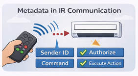
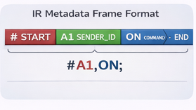
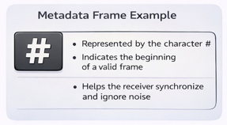
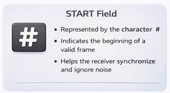
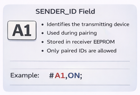
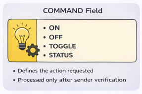
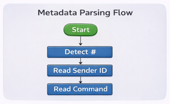
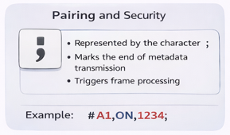
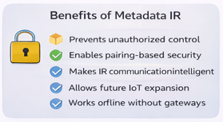
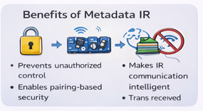

# Metadata Format

The **IR-Blaster-Protocol-V2.0** uses structured metadata embedded directly inside infrared (IR) signals.  
Unlike traditional IR remotes that transmit only commands, this protocol sends **identity and command information together**.

This enables:
- Secure pairing
- Sender authentication
- Gateway-less operation
- Future IoT compatibility

---

## Metadata Concept Overview

Each IR signal carries a small data frame containing metadata fields.  
The receiver reads this metadata, verifies authorization, and executes the command.

---

## Metadata Frame Structure

The frame is divided into logical fields:

---

## START Field

- Represented by the character `#`
- Indicates the beginning of a valid metadata frame
- Helps the receiver synchronize and ignore noise

Example:

---

## SENDER_ID Field

- Identifies the transmitting device
- Used during pairing
- Stored in receiver EEPROM
- Only paired IDs are allowed

Example:

---

## COMMAND Field

- Defines the action requested
- Processed only after sender verification

Example commands:

---

## END Field

- Represented by the character `;`
- Marks the end of metadata transmission
- Triggers frame processing

Example:

---

## Metadata Parsing Flow

1. Detect the `START` character
2. Read sender ID
3. Read command
4. Detect the `END` character
5. Verify pairing
6. Execute command

---

## Optional Metadata (Future Enhancement)

Additional fields can be added without breaking compatibility:
- Timestamp
- Authentication token
- Error detection (CRC)

Example:

---

## Why Metadata Is Important

- Prevents unauthorized control
- Enables pairing-based security
- Makes IR communication intelligent
- Allows future IoT expansion
- Works without cloud or gateways

---

## Summary

The metadata format transforms infrared communication from a simple signal-based system into a **structured, secure, and extensible protocol**. By embedding identity and control information directly into IR frames, IR-Blaster-Protocol-V2.0 enables reliable and intelligent device control using minimal hardware.

