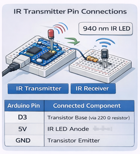
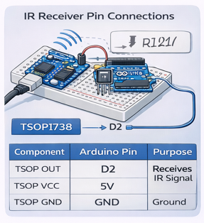
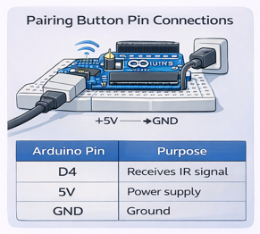
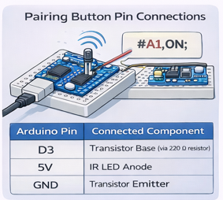
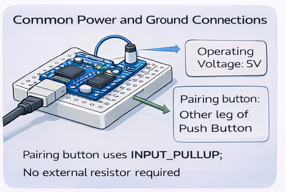
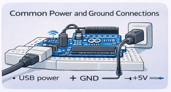

# Pin Connections

This section describes the **exact pin connections** used in the **IR-Blaster-Protocol-V2.0** hardware setup. The system consists of two parts:

1. **IR Transmitter Unit**
2. **IR Receiver Unit with Pairing Support**

All connections are made using standard Arduino Uno pins.

---

## 1. IR Transmitter Pin Connections

The IR transmitter sends metadata-embedded infrared signals using an IR LED.

### Components Used
- Arduino Uno
- IR LED
- NPN Transistor (BC547 / 2N2222)
- 220 Ω Resistor

### Pin Mapping

| Arduino Pin | Connected Component | Purpose |
|------------|---------------------|--------|
| D3 | Transistor Base (via 220 Ω resistor) | Generates IR signal |
| 5V | IR LED Anode | Supplies power to IR LED |
| GND | Transistor Emitter | Common ground |

### Explanation
- Pin **D3** outputs pulse signals representing metadata.
- The transistor amplifies current for stronger IR transmission.
- The resistor protects the Arduino pin from excess current.

---

## 2. IR Receiver Pin Connections

The IR receiver detects infrared signals, extracts metadata, and verifies pairing.

### Components Used
- Arduino Uno
- IR Receiver Module (TSOP1738 / VS1838B)
- LED
- 220 Ω Resistor

### Pin Mapping

| Component | Arduino Pin | Purpose |
|---------|------------|--------|
| TSOP OUT | D2 | Receives IR signal |
| TSOP VCC | 5V | Power supply |
| TSOP GND | GND | Ground |
| LED Anode | D13 (via 220 Ω) | Status indication |
| LED Cathode | GND | Ground |

### Explanation
- The TSOP module outputs a LOW signal when IR is detected.
- The LED indicates authorized command execution.

---

## 3. Pairing Button Pin Connections

The pairing button allows the receiver to enter pairing mode.

### Components Used
- Push Button
- Arduino Uno

### Pin Mapping

| Arduino Pin | Connected To | Purpose |
|------------|-------------|--------|
| D4 | One leg of Push Button | Pairing mode input |
| GND | Other leg of Push Button | Ground |

> **Note:** The pairing button uses `INPUT_PULLUP`, so no external resistor is required.

### Explanation
- When the button is pressed, pin **D4** reads LOW.
- This activates pairing mode in the receiver firmware.

---

## 4. Common Power and Ground Connections

- Both transmitter and receiver are powered via USB
- Operating voltage: **5V**
- All components share a common ground reference

---

## 5. Summary of Pin Usage

| Pin | Function |
|----|---------|
| D2 | IR Receiver Input |
| D3 | IR Transmitter Output |
| D4 | Pairing Button Input |
| D13 | Status LED Output |
| 5V | Power Supply |
| GND | Common Ground |

---

## Summary

The pin connections are kept minimal and organized to ensure reliable operation of the IR-Blaster-Protocol-V2.0 system. By using standard Arduino pins and simple wiring, the hardware remains easy to assemble, debug, and extend for future enhancements.

