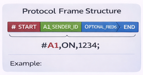
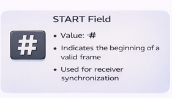
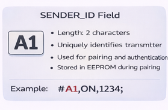
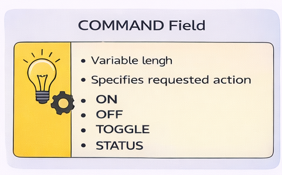
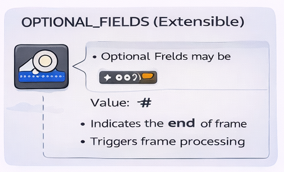
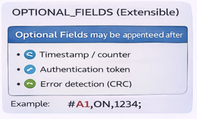
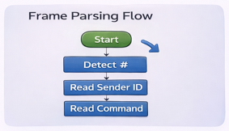
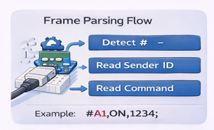
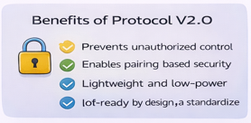

# Protocol Specification V2.0

The **IR-Blaster-Protocol V2.0** defines a structured infrared communication protocol that embeds metadata directly within IR signals. Unlike traditional IR protocols that transmit only raw commands, V2.0 introduces **identity, pairing, and extensibility** while remaining lightweight and gateway-less.

---

## Design Goals

The protocol is designed with the following objectives:

- Embed sender identity in every IR transmission
- Support pairing-based authentication
- Remain compatible with simple microcontrollers
- Operate without cloud or IoT gateways
- Allow future extensibility (security, IoT, logging)

---

## Protocol Versioning

| Version | Description |
|-------|------------|
| V1.0 | Basic command-only IR transmission |
| **V2.0** | Metadata-aware IR protocol with pairing support |

---

## Frame Structure

Each IR message follows a structured frame format:

### Example Frame

---

## Field Definitions

### START Field

- Value: `#`
- Indicates the beginning of a valid frame
- Used for receiver synchronization

---

### SENDER_ID Field

- Length: 2 characters
- Uniquely identifies the transmitter
- Used for pairing and authentication
- Stored in EEPROM during pairing

Example:

---

### COMMAND Field

- Variable length
- Specifies the requested action

Example commands:

---

### OPTIONAL FIELDS (Extensible)

Optional fields may be appended after the command:

- Timestamp / counter
- Authentication token
- Error detection (CRC)

Example:

---

### END Field

- Value: `;`
- Marks the end of the frame
- Triggers frame processing

---

## Frame Parsing Logic

The receiver processes incoming frames as follows:

1. Detect `START` character
2. Read `SENDER_ID`
3. Extract `COMMAND`
4. Validate pairing
5. Process optional fields
6. Execute command if authorized

---

## Pairing and Authentication

- Pairing stores the trusted `SENDER_ID`
- Only paired senders are allowed
- Unauthorized frames are ignored
- No encryption required for basic security

This ensures **secure local control** without network dependency.

---

## Error Handling

- Frames without valid START/END are discarded
- Unauthorized sender IDs are rejected
- Corrupted frames can be detected using optional CRC (future)

---

## Timing Characteristics (Logical Level)

- Frame-based communication
- No strict dependency on carrier frequency in prototype
- Can be extended to precise 38 kHz decoding

---

## Backward Compatibility

- Legacy IR devices ignore metadata
- V2.0 receivers parse structured frames
- Optional fields do not break core parsing

---

## Advantages of Protocol V2.0

- Identity-aware IR communication
- Secure pairing without cloud
- Lightweight and low-power
- IoT-ready by design
- Easy to extend and standardize

---

## Summary

The **IR-Blaster-Protocol V2.0** transforms infrared communication into a **structured, secure, and extensible protocol**. By embedding metadata directly into IR frames, it enables pairing-based authentication and future IoT integration while remaining simple enough for low-cost embedded systems.

