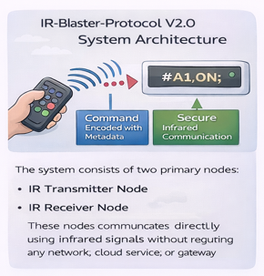
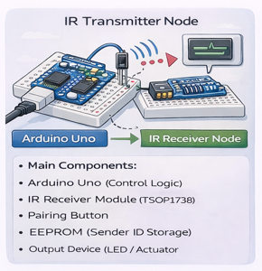
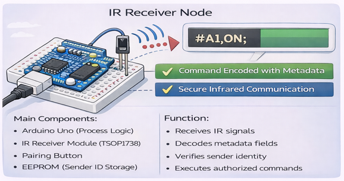
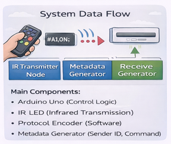
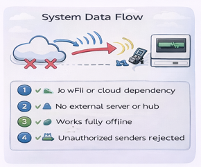
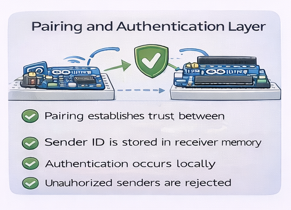
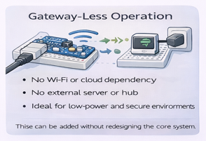
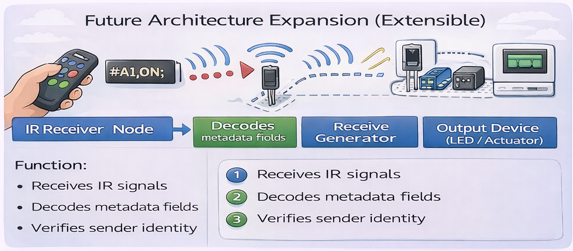
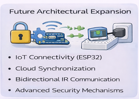
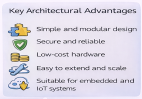

# System Architecture

The **IR-Blaster-Protocol-V2.0** system architecture defines how infrared-based devices communicate securely using embedded metadata and pairing-based authentication. The architecture is designed to be **gateway-less**, **lightweight**, and **extensible for future IoT integration**.

---

## High-Level Architecture Overview

The system consists of two primary nodes:

1. **IR Transmitter Node**
2. **IR Receiver Node**

These nodes communicate directly using infrared signals without requiring any network, cloud service, or gateway.

---

## Architectural Components

### 1. IR Transmitter Node

The transmitter node is responsible for generating infrared signals that carry structured metadata.

**Main Components:**
- Arduino Uno (Control Logic)
- IR LED (Infrared Transmission)
- Protocol Encoder (Software)
- Metadata Generator (Sender ID, Command)

**Function:**
- Encodes metadata into protocol frames
- Converts frames into IR pulses
- Transmits IR signals to the receiver

---

### 2. IR Receiver Node

The receiver node detects incoming IR signals and processes the embedded metadata.

**Main Components:**
- Arduino Uno (Processing Logic)
- IR Receiver Module (TSOP1738)
- Pairing Button
- EEPROM (Sender ID Storage)
- Output Device (LED / Actuator)

**Function:**
- Receives IR signals
- Decodes metadata fields
- Verifies sender identity
- Executes authorized commands

---

## Data Flow Architecture

The communication flow follows a strict sequence:

1. User triggers command on transmitter
2. Metadata frame is generated
3. IR signal is transmitted
4. Receiver detects IR signal
5. Metadata is extracted
6. Pairing is verified
7. Command is executed

---

## Pairing and Authentication Layer

- Pairing establishes trust between transmitter and receiver
- Sender ID is stored in receiver memory
- Authentication occurs locally on every command
- Unauthorized senders are rejected

This layer ensures **secure device-level control**.

---

## Gateway-Less Operation

- No Wi-Fi or cloud dependency
- No external server or hub
- Works fully offline
- Ideal for low-power and secure environments

---

## Extensible Architecture (Future Scope)

The architecture supports future enhancements such as:
- IoT connectivity (ESP32)
- Cloud synchronization
- Bidirectional IR communication
- Advanced security mechanisms

These can be added without redesigning the core system.

---

## Key Architectural Advantages

- Simple and modular design
- Secure and reliable
- Low-cost hardware
- Easy to extend and scale
- Suitable for embedded and IoT systems

---

## Summary

The **IR-Blaster-Protocol-V2.0 System Architecture** provides a clean and modular design for secure infrared communication. By embedding intelligence directly into IR signals and enforcing pairing-based authentication at the device level, the system achieves reliable and scalable control without relying on network infrastructure.

